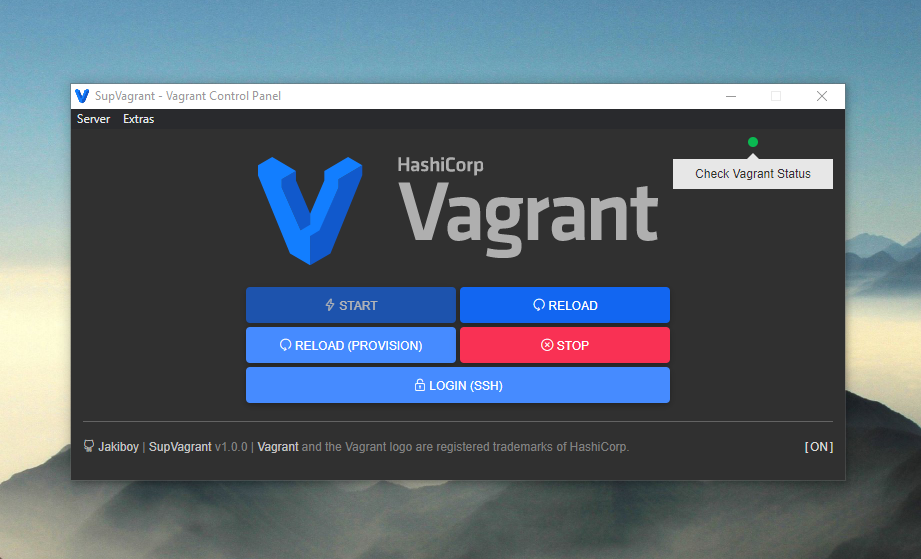

# Vagrant: Windows Installer

Vagrant for Windows 10/11 x64,
Includes:

* Oracle VM **VirtualBox** v7.0.x.
* **ngrok**.
* **SupVagrant** (Vagrant Control Panel) | Open-source.
* Pre-configured **Vagrantfile** (LAMP Provisioner).
* **Debian** (Bullseye) guest.



## References

- [Source: developer.hashicorp.com](https://developer.hashicorp.com/vagrant)

## ⚡ Make
  
```bash
bash compile.sh
```
